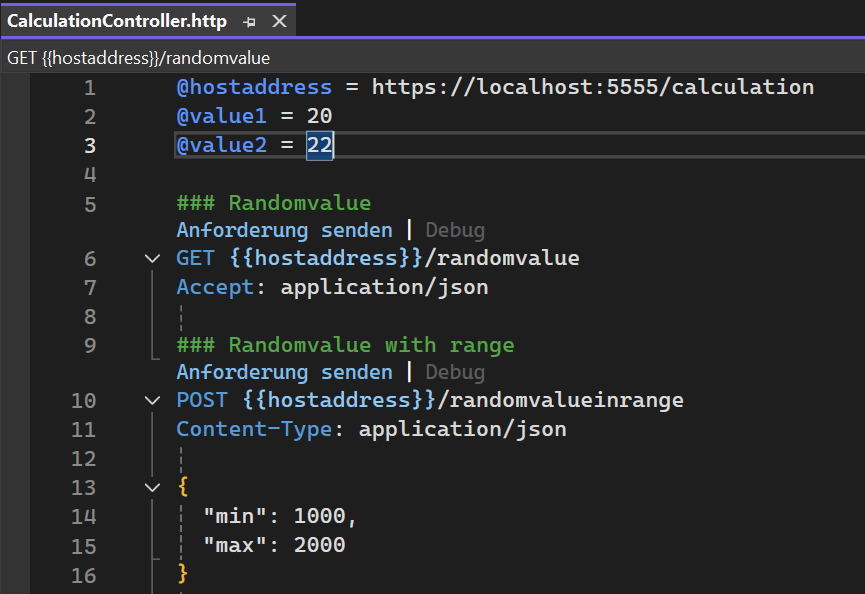
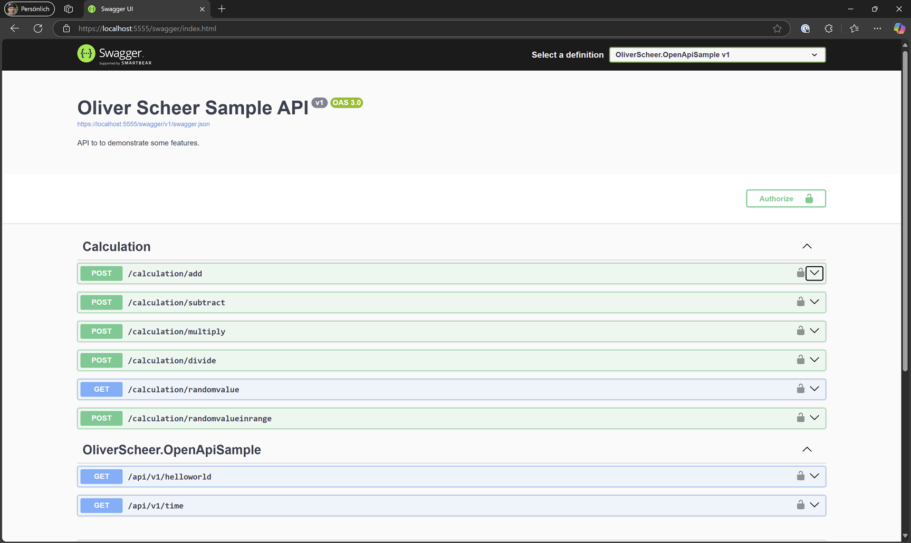
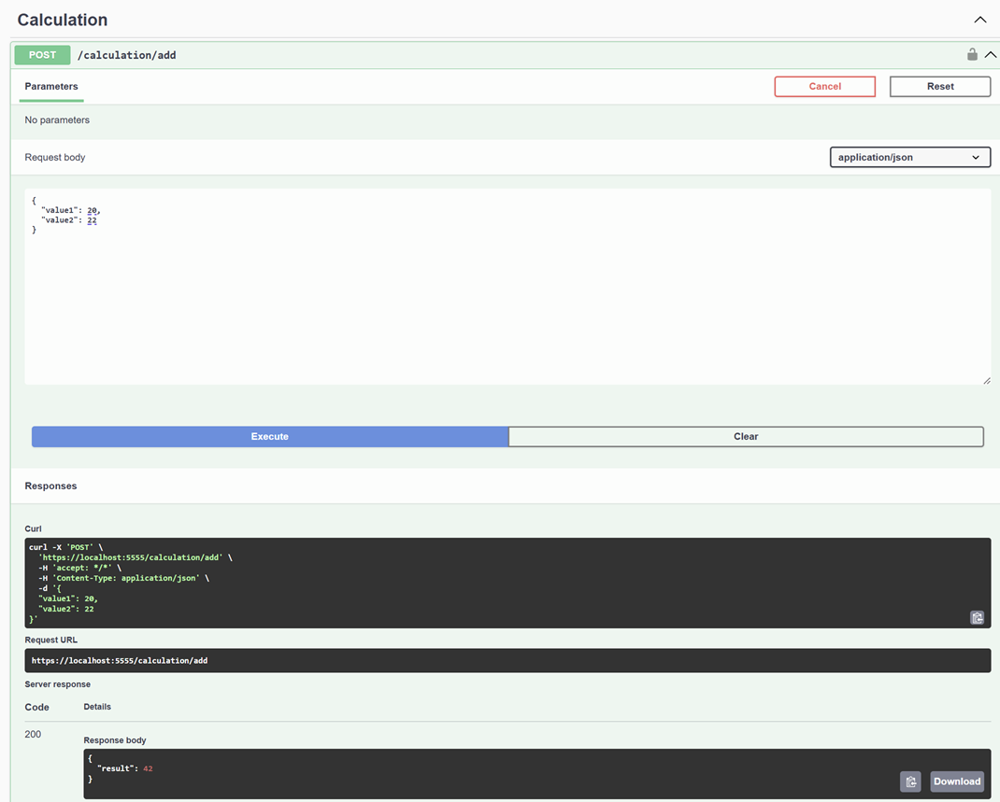
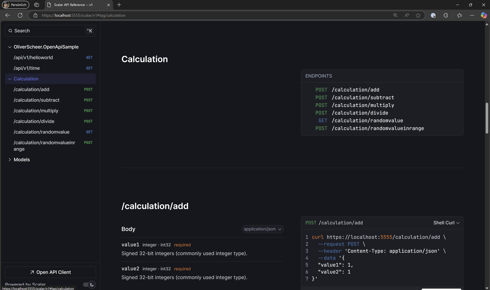
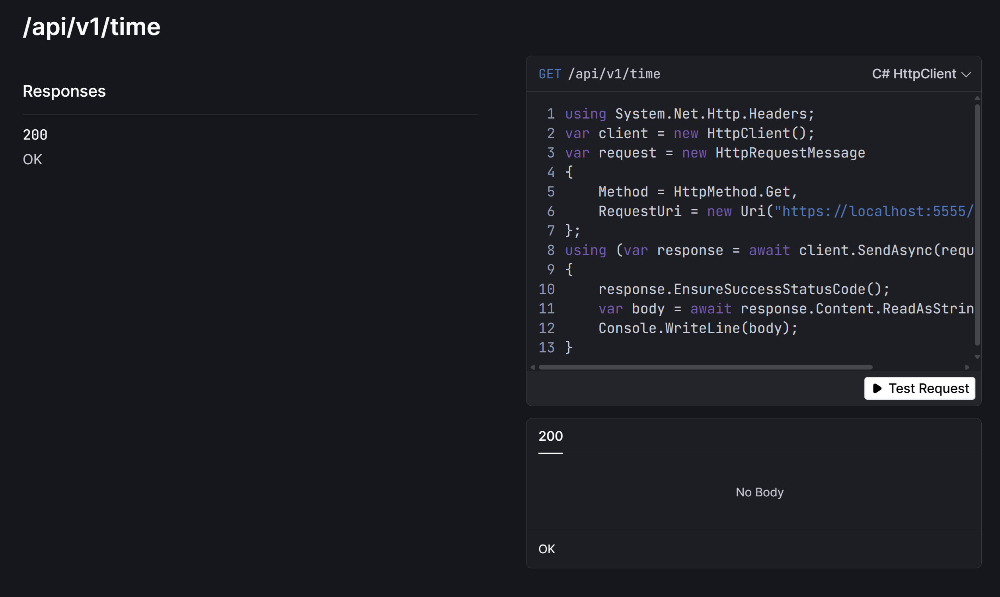

# OpenAPI Documentation and Testing in .NET 9

## **Introduction to OpenAPI in ASP.NET Core 9**

With the release of **.NET 9**, the ASP.NET Core team has decided to **remove built-in Swagger support** (Swashbuckle) for several key reasons:

- **Maintenance Challenges**: Swashbuckle is no longer actively maintained, lacks updates, and doesn’t have an official release for .NET 8.  
- **Native Metadata Support**: ASP.NET Core now includes built-in metadata to describe APIs, reducing the need for external tools.  
- **Focus on OpenAPI**: Microsoft is enhancing OpenAPI support natively with `Microsoft.AspNetCore.OpenApi` to provide seamless documentation generation.  
- **Modern Alternatives**: Tools like **.http files** and the **Endpoints Explorer** in Visual Studio allow testing and exploration without relying on third-party packages.  
- **Encouraging Innovation**: Removing Swashbuckle as a default encourages community-driven tools that better suit developer needs.

This project demonstrates how to adapt to these changes by leveraging **modern alternatives** and provides practical examples to help you get started.

## **What's Included in This Project**

To help developers transition to the new direction of **ASP.NET Core 9**, this repository includes **three samples**:

1. **Using .http Files**: A lightweight and modern way to test APIs in **Visual Studio** and **VS Code**.  
2. **Re-adding Swagger Support**: A sample for those who still want to use Swagger (Swashbuckle) for API documentation.  
3. **Introducing Scalar**: A powerful alternative to Swagger with additional features, a modern UI, and rich API exploration capabilities.

## **Using .http Files**

**.http files** allow you to define and test **HTTP requests** directly from your editor, such as **Visual Studio Code** with the **REST Client** extension or **Visual Studio**.

### **Why .http Files?**

- Lightweight, simple, and human-readable.
- Allows quick testing of endpoints.  
- Supports variables and response reuse in **Visual Studio Code**.

### **Example: A Simple .http File**

```text
@hostaddress = https://localhost:5555/calculation
@value1 = 20
@value2 = 22

### Add Request
# @name add
POST {{hostaddress}}/add
Content-Type: application/json

{
  "value1": {{value1}},
  "value2": {{value2}}
}

### Reuse Response
@addresult = {{add.response.body.result}}

POST {{hostaddress}}/add
Content-Type: application/json

{
  "value1": {{addresult}},
  "value2": {{addresult}}
}
```

### **Notes:**

- In **Visual Studio Code**, the **REST Client** extension supports variables and response reuse (e.g., `add.response.body.result`).  
- In **Visual Studio**, response variables are not yet supported, but you can still execute requests and debug effectively.

**Example UI in Visual Studio:**



## **Re-Adding Swagger Support**

While Swagger has been removed from .NET 9, you can easily add it back using Swashbuckle.

### **Steps to Add Swagger:**

1. **Install Required NuGet Packages**:

   ```bash
   dotnet add package Microsoft.AspNetCore.OpenApi
   dotnet add package Swashbuckle.AspNetCore
   ```

2. **Update `Program.cs`:**

   ```csharp
   builder.Services.AddSwaggerGen(options =>
   {
       options.SwaggerDoc("v1", new OpenApiInfo
       {
           Title = "Sample API",
           Version = "v1",
           Description = "API to demonstrate Swagger integration."
       });
   });
   
   // some code

   if (app.Environment.IsDevelopment())
   {
       app.UseSwagger();
       app.UseSwaggerUI();
   }
   ```

### **Swagger UI Preview:**

Swagger provides a clear interface to explore and test your API endpoints.





## **Introducing Scalar: A Modern Alternative**

**Scalar** is an open-source API platform that takes API documentation and testing to the next level. It offers modern features, an intuitive user experience, and a sleek interface (with dark mode for real engineers!).

### **Why Use Scalar?**

- **Modern REST Client**: Test and interact with APIs seamlessly.  
- **Beautiful API References**: Generates clean, readable API documentation.  
- **Code Generation**: Generate samples in 25+ languages or frameworks.  

### **Scalar Example Output**

#### **C# Example:**

```csharp
using System.Net.Http.Headers;

var client = new HttpClient();
var request = new HttpRequestMessage
{
    Method = HttpMethod.Get,
    RequestUri = new Uri("https://localhost:5555/api/v1/time"),
};
using (var response = await client.SendAsync(request))
{
    response.EnsureSuccessStatusCode();
    var body = await response.Content.ReadAsStringAsync();
    Console.WriteLine(body);
}
```

#### **JavaScript/jQuery Example:**

```javascript
const settings = {
  async: true,
  crossDomain: true,
  url: 'https://localhost:5555/api/v1/time',
  method: 'GET',
  headers: {}
};

$.ajax(settings).done(function (response) {
  console.log(response);
});
```

### **Adding Scalar to Your Project**

1. **Install Scalar NuGet Package**:

   ```bash
   dotnet add package Scalar.AspNetCore
   ```

2. **Update `Program.cs`:**

   ```csharp
   if (app.Environment.IsDevelopment())
   {
       app.MapScalarApiReference();
   }
   ```

### **Scalar UI Preview**




## **Summary**

With .NET 9, Microsoft has shifted focus to native OpenAPI support, removing the dependency on Swashbuckle. However, with **.http files**, **Swagger**, and **Scalar**, you have powerful tools at your disposal:

1. Use **.http files** for lightweight API testing.  
2. Re-integrate **Swagger** for familiar interactive documentation.  
3. Explore **Scalar** for a modern, feature-rich alternative with advanced capabilities.  

### **Source Code**  

Find all samples in the GitHub repository: [OpenAPI Documentation in .NET 9](https://github.com/oliverscheer/open-api-documentation-in-dotnet-9).
